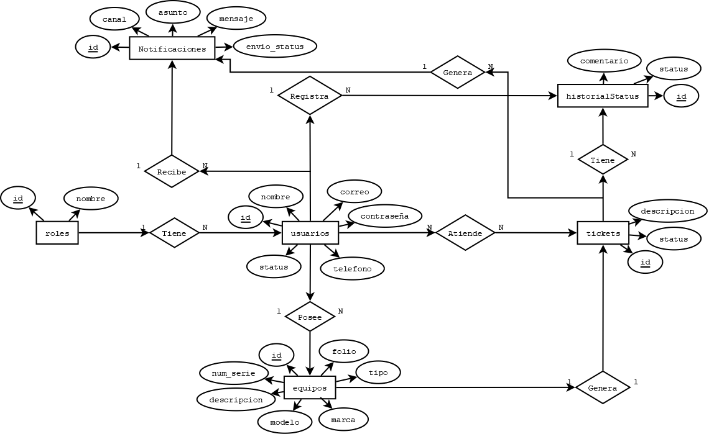

# YINtrack

Sistema de tickets de servicio técnico con notificaciones automáticas por medio de correo electrónico.

**Equipo 10**

## Integrantes

- Yhudiel Mendoza Sánchez
- Noel López Herrera

## Enlaces del proyecto

- **Repositorio:** https://github.com/Sonnx18/yintrack
- **Proyecto desplegado (producción, HTTPS):** https://ticketcitoyin.help
- **URL base de la API:** https://ticketcitoyin.help/api
- **Prototipo en Figma:** https://www.figma.com/proto/TIpYKxoevnzVXOVP9pPcRT/Act7---Mockup-Sistema--Equipo-10?node-id=1-23&t=GO5hBbqNyAkC9cyA-1&scaling=contain&content-scaling=fixed&page-id=0%3A1&starting-point-node-id=1%3A22
- **GitHub Projects (backlog):** https://github.com/users/Sonnx18/projects/1/views/1

## Descripción del proyecto

Elegimos este proyecto porque tanto mi compañero como yo brindamos servicios técnicos (reparación de equipos), y en el día a día nos dimos cuenta de que no llevamos un control ordenado de los pedidos: se nos complica saber en qué estado va cada equipo y mantener informado al cliente sin tener que estar respondiendo mensajes uno por uno.

Por eso decidimos desarrollar YINtrack, una aplicación web para llevar el control de los pedidos de servicio técnico. Antes de poder generar un folio para un equipo, es necesario que exista un cliente registrado como dueño de ese equipo. El registro del cliente puede hacerse de dos formas: de manera presencial (cuando el técnico registra el equipo nuevo en el taller) o en línea, de forma autónoma por el propio cliente.

Cada equipo recibido genera un folio único (un folio corresponde a un solo equipo), que sirve para la búsqueda y seguimiento del pedido: cualquier persona puede consultar el estado del equipo con ese folio, sin necesidad de iniciar sesión. Adicionalmente, el cliente puede iniciar sesión con su cuenta para ver de forma simultánea el estatus de todos sus pedidos activos sin tener que ingresar folio por folio. Los técnicos se asignan automáticamente a cada equipo nuevo (balanceando la carga según quién tenga menos tickets activos en ese momento), y el cliente recibe notificaciones automáticas por correo cada vez que el estado de su ticket cambia (recibido, en diagnóstico, en reparación, listo, entregado).

## Módulos principales

- roles
- usuarios
- equipos
- tickets
- historial_estados
- notificaciones
- tecnico_ticket
- tokens_invalidados

## Roles de usuario

- Administrador
- Técnico
- Cliente

## Stack

- **Backend:** Spring Boot 4.1 (Java 21), Spring Data JPA, Spring Security + JWT
- **Frontend:** React 19 + Vite + Tailwind CSS
- **Base de datos:** MySQL 8 real (no MariaDB)
- **Migraciones:** Flyway (esquema versionado, sin tocar la BD a mano)
- **Autenticación:** JWT stateless, con roles para Administrador, Técnico y Cliente
- **Notificaciones:** correo (JavaMailSender vía SMTP) y WhatsApp (Twilio)
- **Pruebas de API:** Bruno (colección incluida en `bruno/`)
- **Despliegue:** VPS (Hetzner), systemd + Nginx + Let's Encrypt (HTTPS)

## Diagrama Entidad-Relación



---

## Instalación local

### Requisitos previos

- Java 21
- MySQL Server real corriendo localmente (no XAMPP/MariaDB)
- Node.js (para el frontend)

### Backend

1. Crear la base de datos y el usuario:
   ```sql
   CREATE DATABASE yintrack_db CHARACTER SET utf8mb4;
   CREATE USER 'yintrack_app'@'localhost' IDENTIFIED BY 'tu_password_local';
   GRANT ALL PRIVILEGES ON yintrack_db.* TO 'yintrack_app'@'localhost';
   FLUSH PRIVILEGES;
   ```
2. Exportar la contraseña como variable de entorno (PowerShell):
   ```powershell
   $env:DB_PASSWORD = "tu_password_local"
   ```
3. Levantar el backend:
   ```powershell
   cd backend
   .\mvnw.cmd spring-boot:run
   ```
   Flyway crea las tablas y carga los datos de prueba automáticamente al arrancar (ver [Credenciales de prueba](#credenciales-de-prueba)).

El resto de variables (`JWT_SECRET`, `MAIL_*`, `TWILIO_*`, `CORS_ALLOWED_ORIGINS`) tienen defaults funcionales para desarrollo local — ver `backend/src/main/resources/application.properties.example` para la lista completa.

### Frontend

```powershell
cd frontend
copy .env.example .env
npm install
npm run dev
```

Abre `http://localhost:5173`. El `.env` ya apunta a `http://localhost:8080/api` (el backend local).

### Probar la API sin frontend

La colección de Bruno en `bruno/YINtrack/` trae los requests armados (login por rol, registro, equipos, tickets, usuarios) con dos environments: **Local** (`http://localhost:8080/api`) y **Produccion** (`https://ticketcitoyin.help/api`).

---

## Credenciales de prueba

Usuarios de ejemplo cargados por el seed de datos (`V2__seed_data.sql`), disponibles tanto en local como en producción:

| Rol | Correo | Contraseña |
|---|---|---|
| Administrador | `admin@yintrack.com` | `Admin123!` |
| Técnico | `tecnico1@yintrack.com` | `Tecnico123!` |
| Técnico | `tecnico2@yintrack.com` | `Tecnico123!` |
| Cliente | `cliente1@yintrack.com` | `Cliente123!` |
| Cliente | `cliente2@yintrack.com` | `Cliente123!` |

(Hay 4 técnicos y 10 clientes en total en el seed, todos con la misma contraseña por rol — ver `backend/src/main/resources/db/migration/V2__seed_data.sql` para la lista completa.)
